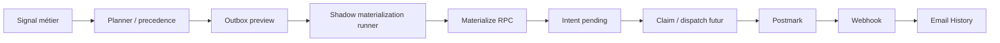

# Dossier technique — Email transactionnel client (Phone Farm / BoostMyBusinesses)

**Document canonique de passation** — point d’entrée pour comprendre, exploiter, auditer et activer progressivement le système d’email transactionnel client.

**Dépôt :** `boost-ai-frontend` (GitHub `Xstoneekwa/boost-my-businesses-frontend`)  
**Base de production :** Supabase `zgafnshkjywfltxgbtzg` (main prod uniquement)  
**Domaine canonique :** `https://www.boostmybusinesses.com`  
**Dernière vérification documentaire :** 2026-06-25 — commits jusqu’à `b5910d8` (`feat: add dormant client email materialize executor`)

---

## Table des matières

1. [Résumé exécutif](#1-résumé-exécutif)
2. [Architecture de bout en bout](#2-architecture-de-bout-en-bout)
3. [Concepts métier](#3-concepts-métier)
4. [Catégories email et règles métier](#4-catégories-email-et-règles-métier)
5. [Email client canonique et no-leak policy](#5-email-client-canonique-et-no-leak-policy)
6. [Sender, support, templates et snapshots](#6-sender-support-templates-et-snapshots)
7. [Postmark et webhook](#7-postmark-et-webhook)
8. [Tables, contraintes et migrations](#8-tables-contraintes-et-migrations)
9. [Materialize : état actuel et garanties SQL](#9-materialize--état-actuel-et-garanties-sql)
10. [Gates, watermarks et état réel actuel](#10-gates-watermarks-et-état-réel-actuel)
11. [Endpoints et sécurité](#11-endpoints-et-sécurité)
12. [État production vérifié](#12-état-production-vérifié)
13. [Runbook : activation progressive future](#13-runbook--activation-progressive-future)
14. [Runbook : rollback / incident](#14-runbook--rollback--incident)
15. [Runbook : évolution](#15-runbook--évolution)
16. [Tests et checklist exploitation](#16-tests-et-checklist-exploitation)
17. [Known limitations / prochaines étapes](#17-known-limitations--prochaines-étapes)

### Documents de détail (ne pas dupliquer ici)

| Document | Sujet |
|----------|--------|
| [client-email-postmark.md](./client-email-postmark.md) | Provider Postmark, test delivery, delivery settings, code map |
| [client-email-materialize-dispatch-contract.md](./client-email-materialize-dispatch-contract.md) | Contrat Materialize / Dispatch, gates par couche, atomicité RPC |
| [client-email-lifecycle-episodes.md](./client-email-lifecycle-episodes.md) | Episodes lifecycle (`account_paused`, `account_canceled`, `needs_assistance`) |
| [client-email-needs-more-targets-lifecycle.md](./client-email-needs-more-targets-lifecycle.md) | Séquences needs-more, réconciliation, gates catégorie |
| [instagram-dashboard-admin.md](./instagram-dashboard-admin.md) | Dashboard admin Instagram (contexte BotApp / relay) |
| [supabase/MIGRATION_HISTORY.md](../supabase/MIGRATION_HISTORY.md) | Parité migrations locales ↔ remote prod |

---

## 1. Résumé exécutif

### Objectif

Notifier les clients BoostMyBusinesses par email transactionnel lors d’événements métier sur leurs comptes Instagram gérés (pause, annulation, assistance, besoin de cibles supplémentaires), avec traçabilité complète (intents, webhooks, Email History), sans fuite de données sensibles.

### Ce qui fonctionne déjà

| Capacité | Statut |
|----------|--------|
| Schéma DB email (templates, intents, events, episodes, sequences, delivery settings) | **Déployé** en prod |
| Templates transactionnels (4 catégories, version active + retired) | **8 lignes** en prod |
| BotApp : Email History, Transactional Email Templates, delivery settings | **Opérationnel** (relay/admin) |
| Envoi **test interne** (`intent_kind=test`, `manual_test`) | **Historique** : 2 intents test `sent` + 2 delivery events |
| Webhook Postmark → `client_email_delivery_events` | **Validé** (déduplication par `webhook_event_id`) |
| Planner / outbox preview (lecture seule, precedence) | **Actif** via API relay/admin |
| Shadow materialization runner (preview sans RPC) | **Actif** — `rpcInvoked=false`, `mutationExecuted=false` |
| RPC SQL `materialize_client_email_outbox_candidate_v1` | **Déployée** en prod |
| Executor Materialize dormant (`CLIENT_EMAIL_MATERIALIZE_ENABLED`) | **Code présent**, non branché à une route/cron |

### Ce qui reste dormant

- Automation lifecycle et needs-more (`CLIENT_EMAIL_*_AUTOMATION_ENABLED` fermées).
- Watermarks anti-backfill (`*_AUTOMATION_ENABLED_AT` non configurés en prod).
- Gate Materialize (`CLIENT_EMAIL_MATERIALIZE_ENABLED` absente / fermée).
- Executor Materialize (module isolé, jamais invoqué en runtime).
- Claim / dispatch client lifecycle (schéma prêt, worker absent).
- Scheduler (aucun cron/queue connecté — `schedulerConnected: false`).

### Ce qui est explicitement désactivé

- **`CLIENT_EMAIL_SENDING_ENABLED`** : envoi lifecycle client bloqué côté provider.
- **`CLIENT_EMAIL_TEST_SENDING_ENABLED`** : envoi test BotApp bloqué (gate prod fermée).
- Retry provider automatique : **non implémenté**.
- Retry après `dispatch_uncertain` : **interdit par contrat** (futur).

### Pourquoi aucun email lifecycle client ne peut partir aujourd’hui

Plusieurs barrières indépendantes empêchent tout envoi client lifecycle :

1. **Aucun intent `intent_kind=client`** n’existe en prod (0 ligne).
2. **Aucune séquence** needs-more ni **episode** lifecycle persisté (0 ligne).
3. **Watermarks** anti-backfill non définis → preview classe les comptes historiques en `blockedLegacyPreWatermark`.
4. **Automation** lifecycle et needs-more **désactivées**.
5. **Gate Materialize** fermée → shadow runner skip avec `materialize_gate_closed`.
6. **RPC Materialize** jamais appelée par le runtime.
7. **Pas de route execute**, **pas de scheduler**, **pas de worker dispatch**.
8. **`CLIENT_EMAIL_SENDING_ENABLED=false`** → même un intent futur ne serait pas dispatché.

```text
Le système est prêt pour une future matérialisation contrôlée d’intents,
mais aucun intent client lifecycle n’a encore été créé et aucun dispatch
client n’est actif.
```

---

## 2. Architecture de bout en bout

### Flux cible (couches)



### Statut par étape

| Étape | Statut | Notes |
|-------|--------|-------|
| Signal métier | **Actif** | `ig_accounts.admin_lifecycle_status`, `account_dashboard_actions`, `ig_targets`, `ig_action_logs` |
| Planner / precedence | **Déployé** | Read-only ; 1 candidat effectif / compte |
| Outbox preview | **Déployé** | API relay/admin, réponses redacted |
| Shadow materialization runner | **Déployé** | Preview only ; pas d’écriture DB |
| Materialize RPC | **Déployé, jamais invoqué** | Service-role ; `SECURITY DEFINER` |
| Executor Materialize | **Dormant** | Gate `CLIENT_EMAIL_MATERIALIZE_ENABLED` ; non importé par routes |
| Intent `pending` | **Schéma prêt** | 0 intent client en prod |
| Claim / dispatch | **Non implémenté runtime** | Colonnes claim migration appliquées |
| Postmark lifecycle | **Bloqué** | Adapter lifecycle refuse si sending disabled |
| Webhook | **Déployé** | Test intents historiques seulement |
| Email History | **Déployé** | BotApp + API relay |

### Trois couches indépendantes (contrat canonique)

Voir [client-email-materialize-dispatch-contract.md §2](./client-email-materialize-dispatch-contract.md) :

1. **Planner / Preview** — jamais d’écriture ; ne dépend **pas** de `CLIENT_EMAIL_SENDING_ENABLED`.
2. **Materialize** — persiste parent + intent ; ne dépend **pas** de sending enabled.
3. **Dispatch** — seule couche autorisée à appeler Postmark pour lifecycle client ; **requiert** `CLIENT_EMAIL_SENDING_ENABLED=true`.

---

## 3. Concepts métier

| Concept | Définition |
|---------|------------|
| **Raw observation** | Candidat théorique par compte + catégorie avant precedence (plusieurs par compte possibles). |
| **Effective candidate** | Candidat retenu après precedence — **un seul par compte**. |
| **Suppression par precedence** | Catégories moins prioritaires marquées `suppressed_by_precedence` ; non materialisables tant qu’une catégorie plus forte gagne. |
| **Lifecycle episode** | Parent pour `account_paused`, `account_canceled`, `needs_assistance` (`client_email_lifecycle_episodes`). |
| **Needs-more sequence** | Parent pour `needs_more_target_accounts` (`client_email_needs_more_targets_sequences`). |
| **Email intent** | Ligne durable `client_email_send_intents` — snapshot recipient, template, sender, idempotency. |
| **Delivery event** | Ligne `client_email_delivery_events` alimentée par webhook Postmark. |
| **Materialization** | Écriture atomique parent + intent `pending` via RPC (futur execute). |
| **Dispatch** | Claim intent → revalidation → appel Postmark → `provider_message_id`. |
| **`dispatch_uncertain`** | Statut intent futur : résultat provider inconnu ; **pas de retry auto** (migration `20260703120000`). |

### Precedence canonique (V1)

```text
account_canceled
> account_paused
> needs_assistance
> needs_more_target_accounts
```

Implémentation : `client-email-lifecycle-outbox-precedence.ts`.

---

## 4. Catégories email et règles métier

Quatre catégories template/intent : `account_paused`, `account_canceled`, `needs_assistance`, `needs_more_target_accounts`.

### Synthèse par catégorie

| Catégorie | Signal canonique | Parent | Fermeture | Rappel | Anti-backfill | Si canceled/paused/assistance | Activation actuelle |
|-----------|------------------|--------|-----------|--------|---------------|-------------------------------|---------------------|
| `account_paused` | `ig_accounts.admin_lifecycle_status = paused` | lifecycle episode | `admin_lifecycle_status = active` | **Aucun** (V1 initial only) | Watermark + transition `ig_action_logs` ≥ watermark | Precedence : canceled > paused | **Dormant** |
| `account_canceled` | `admin_lifecycle_status = cancelled/canceled` | lifecycle episode | Terminal | **Aucun** | Idem | Gagne precedence | **Dormant** |
| `needs_assistance` | `admin_lifecycle_status = needs_assistance` | lifecycle episode | `admin_lifecycle_status = active` | **Aucun** | Idem | Precedence vs needs-more | **Dormant** |
| `needs_more_target_accounts` | Action active needs-more + `eligible_target_count ≤ 5` | sequence | Targets > 5, signal résolu, ou compte canceled | **6 envois max** (indices 0–5) | Watermark needs-more séparé | Supprimé si canceled gagne | **Dormant** |

Détails episodes : [client-email-lifecycle-episodes.md](./client-email-lifecycle-episodes.md).  
Détails needs-more : [client-email-needs-more-targets-lifecycle.md](./client-email-needs-more-targets-lifecycle.md).

### Messages audit lifecycle (start)

| Catégorie | `ig_action_logs.message` |
|-----------|----------------------------|
| `account_paused` | `account_paused` |
| `account_canceled` | `account_cancelled` |
| `needs_assistance` | `account_marked_needs_assistance` |

### Cycle needs-more (planifié, non actif)

Offsets depuis le début d’épisode (T0 = index 0) :

| Index | Offset | Trigger |
|-------|--------|---------|
| 0 | T0 (immédiat) | `automatic_initial` |
| 1 | +48h | `automatic_reminder` |
| 2 | +5j | `automatic_reminder` |
| 3 | +9j | `automatic_reminder` |
| 4 | +14j | `automatic_reminder` |
| 5 | +21j | `automatic_reminder` |

Source : `CLIENT_EMAIL_REMINDER_OFFSETS_HOURS` dans `client-email-constants.ts`.

**Important :** le scheduler et les envois lifecycle needs-more **ne sont pas actifs**. Aucune séquence n’est persistée en prod.

### Comportement cross-catégorie

- Un compte **canceled** bloque les autres catégories via precedence.
- **`blocked_canceled_account`** empêche l’envoi needs-more / assistance sur compte annulé.
- Les **notifications client** (`client_account_notifications`) restent indépendantes des emails.

---

## 5. Email client canonique et no-leak policy

### Résolution autorisée (ordre strict)

Implémentation : `resolveClientCommunicationEmail()` dans `client-communication-email.ts`.

1. `clients.metadata.contact_email`
2. `clients.metadata.notification_email`
3. `clients.metadata.primary_contact_email`
4. `workspace.auth_email` — **uniquement** en contexte dashboard client (fallback workspace)
5. Sinon **blocage** (`missing_canonical_contact`)

### Interdictions explicites

Ne **jamais** utiliser comme destinataire ou projection publique :

- Email Instagram / login
- Credentials, Vault, `account_credentials`
- Tokens, secrets, service role
- Body/template complet dans previews publiques relay
- UUID Supabase bruts dans projections « safe » (masquage / labels requis)

Champs interdits dans requêtes test : `CLIENT_EMAIL_FORBIDDEN_TEST_RECIPIENT_FIELDS` (`recipient`, `to_email`, `client_email`, etc.).

Previews API exposent `clientEmailMasked` — jamais l’email complet client.

---

## 6. Sender, support, templates et snapshots

### Identité confirmée (prod, lecture seule)

| Rôle | Valeur prod | Source |
|------|-------------|--------|
| **From (sender actif)** | `growth@boostmybusinesses.com` | `transactional_email_delivery_settings.active_from_email` |
| **Support (`{{support_email}}`)** | `growth@boostmybusinesses.com` | `transactional_email_delivery_settings.support_email` |
| **Fallback code (legacy)** | `growth@boostmybusinesses.com` | `CLIENT_EMAIL_LOCKED_FROM` si migration absente |
| **Stream Postmark** | `outbound` | Constante provider |
| **Templates** | DB `client_email_templates` | **Pas** de templates Postmark |

### From vs support vs Reply-To

| Champ | Rôle |
|-------|------|
| **From (`active_from_email`)** | Adresse d’envoi Postmark ; sélectionnable parmi identités Postmark **confirmées** après refresh BotApp |
| **Support (`support_email`)** | Variable template `{{support_email}}` ; éditable indépendamment du From |
| **Reply-To** | Non documenté comme distinct en V1 ; les réponses client suivent la config Postmark du sender |

BotApp : **Transactional delivery settings** + audit (`transactional_email_delivery_settings_audit`).

### Snapshots immuables (intent)

À la materialization / send, persister sur l’intent :

| Colonne | Rôle |
|---------|------|
| `from_email` | From résolu au moment de la création |
| `from_email_snapshot` | Copie immuable pour audit |
| `support_email_snapshot` | Copie immuable du support |
| `recipient_email_snapshot` | Email canonique client |
| `rendered_subject` / `rendered_body_text` | Contenu figé |
| `template_id` / `template_version` | Référence template |

Les settings live ne doivent **pas** être relus après send pour prouver ce qui a été envoyé.

### Protections SQL (RPC Materialize)

| Erreur | Signification |
|--------|---------------|
| `client_email_from_email_snapshot_missing` | Snapshot From absent avant INSERT |
| `client_email_from_email_snapshot_mismatch` | Snapshot From ≠ `from_email` résolu |

Migration : `20260705120000_client_email_materialize_from_email_consistency.sql` → remote `20260627160044`.

---

## 7. Postmark et webhook

### Provider V1

- **Postmark** (`CLIENT_EMAIL_PROVIDER=postmark`)
- **Stream :** `outbound` (transactional)
- **Tracking :** open/click **désactivés**
- **Metadata Postmark :** `intent_id`, `category`, `account_id`, `trigger`, `reminder_index`, `is_test` (tests)

### Webhook

| Élément | Détail |
|---------|--------|
| **URL** | `https://www.boostmybusinesses.com/api/webhooks/postmark` |
| **Auth** | HTTPS Basic Auth (`POSTMARK_WEBHOOK_USERNAME` / `POSTMARK_WEBHOOK_PASSWORD` en Vercel prod — **ne jamais documenter les valeurs**) |
| **Événements suivis** | Delivery, Bounce, SpamComplaint, SubscriptionChange, SMTPApiError |
| **Déduplication** | `webhook_event_id` unique → action `duplicate` si rejoué |
| **Email History** | Agrégation intents + delivery events côté BotApp |

### Envois internes test historiques

2 intents `intent_kind=test`, `trigger=manual_test`, catégories `account_paused` et `account_canceled`, statut `sent`. Destinataire = allowlist `CLIENT_EMAIL_TEST_RECIPIENT` uniquement (non exposé ici).

### Non actif aujourd’hui

- **Dispatch lifecycle client** : bloqué (`CLIENT_EMAIL_SENDING_ENABLED=false`).
- **Scheduler** : absent (`schedulerConnected: false`).
- **Retry provider** : non exécuté automatiquement.

Voir [client-email-postmark.md](./client-email-postmark.md) pour routes test delivery et delivery settings.

---

## 8. Tables, contraintes et migrations

### Tables principales

| Table | Rôle | Invariants importants | Statut prod |
|-------|------|----------------------|-------------|
| `client_email_templates` | Templates par catégorie (subject/body, versioning) | 1 active par catégorie attendue ; variables allowlist | **8 lignes** (4 active + 4 retired) |
| `client_email_send_intents` | Intents d’envoi (client + test) | `idempotency_key` UNIQUE ; parent FK exclusif ; statuts incl. `claimed`, `dispatch_uncertain` | **2 test** `sent`, **0 client** |
| `client_email_delivery_events` | Events webhook | Dédup `webhook_event_id` ; lien `intent_id` | **2 lignes** |
| `client_email_lifecycle_episodes` | Episodes pause/cancel/assistance | CHECK category ; statuts active/resolved/canceled | **0 ligne** |
| `client_email_needs_more_targets_sequences` | Episodes needs-more | Max 6 sends ; close reasons CHECK | **0 ligne** |
| `transactional_email_delivery_settings` | Singleton sender + support | Clé `default` ; `config_version` | **1 ligne** configurée |
| `transactional_email_delivery_settings_audit` | Audit changements sender/support | Append-only métier | Disponible post-migration 9A |

RLS : activée sur tables email ; accès serveur service-role aujourd’hui.

### Parité migrations (local → remote prod)

Le dépôt **n’est pas entièrement bootstrap-reproductible from scratch** sans consulter [MIGRATION_HISTORY.md](../supabase/MIGRATION_HISTORY.md) : les timestamps remote divergent des noms de fichiers locaux.

| Fichier local | Version remote prod | Sujet |
|---------------|---------------------|-------|
| `20260626142335_client_email_foundation.sql` | `20260626142335` | Foundation templates/intents/events |
| `20260628120000_client_email_test_intents.sql` | `20260627000908` | Intents test |
| `20260629120000_client_email_needs_more_targets_sequences.sql` | `20260627005729` | Sequences needs-more |
| `20260630120000_client_email_lifecycle_episodes.sql` | `20260627093518` | Lifecycle episodes |
| `20260701120000_transactional_email_delivery_settings.sql` | `20260627100108` | Delivery settings + snapshots |
| `20260702120000_client_email_intent_episode_links.sql` | `20260627111956` | Parent linkage intents |
| `20260703120000_client_email_dispatch_claim_state.sql` | `20260627132254` | Claim / dispatch_uncertain |
| `20260704120000_client_email_materialize_outbox_rpc.sql` | `20260627135913` | RPC Materialize v1 |
| `20260705120000_client_email_materialize_from_email_consistency.sql` | `20260627160044` | Snapshots From cohérents |
| `20260706120000_client_email_materialize_atomic_preparent_validation.sql` | `20260627165132` | Validations pré-parent create-intent |

**Projet interdit pour validation prod :** `nxntngkhkoynljcagmkq` (test plan-change isolé).

---

## 9. Materialize : état actuel et garanties SQL

### RPC

```text
public.materialize_client_email_outbox_candidate_v1(...)
```

| Propriété | Détail |
|-----------|--------|
| **Accès** | Service-role only (non exposée anon/authenticated) |
| **SECURITY DEFINER** | Oui |
| **search_path** | Restreint (migration) |
| **Lock** | Advisory lock par compte |
| **Ownership** | Vérifié via `client_instagram_accounts` |
| **Idempotency** | Conflit identity → retour idempotent, pas de doublon |
| **Parent exclusif** | `sequence_id` XOR `lifecycle_episode_id` selon catégorie |
| **Statut initial intent** | `pending` |
| **Atomicité** | Parent + intent dans une transaction ; rollback complet sur erreur |

### Opérations strictes

| Famille | Usage |
|---------|-------|
| `open_*` | Parent-only (preview / futur reconcile) — **pas** chaînée avec create en execute |
| `create_lifecycle_initial_intent` / `create_needs_more_initial_intent` | **Chemin execute futur** — une seule RPC |

Sur chemins `create_*_intent` (post migration 14E) :

- Validations recipient / snapshots / idempotency **avant** INSERT parent
- **Aucun** `ok:false` après création parent — `RAISE EXCEPTION` + rollback

### Runtime

La RPC est **déployée en prod** mais **n’a jamais été appelée** par le runtime applicatif. Le shadow runner et l’executor dormant peuvent la cibler uniquement après ouverture explicite de `CLIENT_EMAIL_MATERIALIZE_ENABLED` + branchement execute (non fait).

Contrat détaillé : [client-email-materialize-dispatch-contract.md §4](./client-email-materialize-dispatch-contract.md).

---

## 10. Gates, watermarks et état réel actuel

**Règle :** ne jamais publier les valeurs brutes des variables d’environnement. Seuls les booléens projetés ou raisons stables sont documentés.

| Élément | Rôle | État actuel (prod vérifié) | Effet |
|---------|------|----------------------------|-------|
| **Global sending** (`CLIENT_EMAIL_SENDING_ENABLED`) | Master gate dispatch client | **Fermé** (`globalSendingEnabled: false`) | Aucun envoi lifecycle Postmark |
| **Test sending** (`CLIENT_EMAIL_TEST_SENDING_ENABLED`) | Gate envoi test BotApp | **Fermé** | Send test delivery désactivé |
| **Lifecycle automation** | Autorise materialize lifecycle | **Fermé** | Planner bloque materialize lifecycle |
| **Needs-more automation** | Autorise materialize needs-more | **Fermé** | Idem needs-more |
| **Lifecycle watermark** (`CLIENT_EMAIL_LIFECYCLE_AUTOMATION_ENABLED_AT`) | Anti-backfill lifecycle | **Non configuré** | `blockedLegacyPreWatermark` en preview |
| **Needs-more watermark** (`CLIENT_EMAIL_NEEDS_MORE_TARGETS_AUTOMATION_ENABLED_AT`) | Anti-backfill needs-more | **Non configuré** | Idem |
| **`CLIENT_EMAIL_MATERIALIZE_ENABLED`** | Gate executor / écriture RPC | **Absent / fermé** | Shadow skip `materialize_gate_closed` |
| **Scheduler** | Déclenche reminders | **Absent** (`schedulerConnected: false`) | Aucun rappel needs-more |
| **Provider dispatch** | Postmark lifecycle | **Bloqué** | Adapter + sending gate |

### Règles de dépendance

- **Materialize ne dépend pas** de `CLIENT_EMAIL_SENDING_ENABLED`.
- **Dispatch** est la **seule** couche qui dépendra de sending enabled (futur worker).
- La gate Materialize applicative est **absente/fermée** ; même avec automation ouverte, l’executor n’est pas branché.

---

## 11. Endpoints et sécurité

### Domaine canonique

```text
https://www.boostmybusinesses.com
```

**Non canonique :** l’alias Vercel historique documenté dans `instagram-dashboard-admin.md` (`boost-my-businesses-ai-frontend-vercel-*.vercel.app`) **ne doit pas** servir pour les smokes production des routes email — le domaine custom est la référence.

### Endpoints lifecycle (read-only, relay/admin)

| Méthode | Chemin | Rôle |
|---------|--------|------|
| GET | `/api/instagram-dashboard/email-lifecycle/readiness` | Gates, schema, blocking reasons |
| GET | `/api/instagram-dashboard/email-lifecycle/outbox-preview` | Planner + precedence + gate projections |
| GET | `/api/instagram-dashboard/email-lifecycle/materialization-shadow-preview` | Shadow runner ; `wouldMaterialize`, skip reasons |
| GET | `/api/instagram-dashboard/email-lifecycle/preview` | Preview lifecycle episodes (legacy complément) |

### Auth

- Middleware : `requireRelayOrAdmin`
- Sans auth valide : **401**
- Relay invalide : **403**
- Relay ou admin valide : **200**
- En-tête : **`Cache-Control: no-store`**
- Réponses : **redacted** (emails masqués, pas de secrets)

### Endpoints connexes (hors lifecycle execute)

| Chemin | Rôle |
|--------|------|
| `/api/instagram-dashboard/email-templates` | CRUD templates BotApp |
| `/api/instagram-dashboard/email-history` | Historique relay |
| `/api/instagram-dashboard/email-test-delivery` | Test interne (gate séparée) |
| `/api/instagram-dashboard/email-delivery-settings/*` | Sender/support BotApp |
| `/api/webhooks/postmark` | Ingestion webhook (Basic Auth Postmark) |

**Absent :** route `execute` materialization, route dispatch worker, cron scheduler.

---

## 12. État production vérifié

Vérification lecture seule — 2026-06-25 (API prod + SQL prod).

### Comptages DB

| Métrique | Valeur |
|----------|--------|
| Intents total | 2 |
| Intents `client` | 0 |
| Intents `test` | 2 (`manual_test`, catégories paused + canceled, `sent`) |
| Delivery events | 2 |
| Sequences needs-more | 0 |
| Lifecycle episodes | 0 |
| Templates | 8 (4 active + 4 retired, 1 par catégorie) |

### Previews prod (relay authentifié)

| Métrique | Valeur |
|----------|--------|
| `accountsAnalyzed` | 2 |
| `rawObservations` | 4 |
| `effectiveCandidates` | 2 |
| `suppressedByLifecyclePriority` | 2 |
| `blockedLegacyPreWatermark` | 2 |
| `wouldMaterializeTheoretical` | 0 |
| `readyToDispatchTheoretical` | 0 |
| Shadow `wouldMaterialize` | 0 |
| Shadow `skipped` | 2 (`materialize_gate_closed`, catégorie `account_canceled`) |
| Shadow `rpcInvoked` | false (via `mutationExecuted: false`) |

### Readiness prod

| Champ | Valeur |
|-------|--------|
| `finalReadinessStatus` | `partial` |
| `materializationReadinessStatus` | `partial` |
| `dispatchReadinessStatus` | `partial` |
| `schedulerConnected` | false |
| `globalSendingEnabled` | false |
| `lifecycleAutomationEnabled` | false |
| `needsMoreAutomationEnabled` | false |
| Blocking reasons count | 5 (watermarks ×2, automation ×2, sending disabled) |

Sans auth : readiness retourne **401**.

Aucun ID, email client complet, MessageID provider ou secret n’est consigné dans ce document.

---

## 13. Runbook : activation progressive future

**Ce runbook décrit la procédure cible. Aucune étape n’a été exécutée pour rédiger ce document.**

| # | Étape | Statut implémentation |
|---|-------|----------------------|
| 1 | Vérifier previews + readiness (relay/admin, domaine canonique) | **Disponible** |
| 2 | Définir watermarks ISO explicites (`*_AUTOMATION_ENABLED_AT`) | **Manuel Vercel** — non fait |
| 3 | Ouvrir automation **d’une seule** catégorie | **Manuel Vercel** — non fait |
| 4 | Garder `CLIENT_EMAIL_SENDING_ENABLED=false` | **Recommandé** jusqu’à preuve dispatch |
| 5 | Ouvrir `CLIENT_EMAIL_MATERIALIZE_ENABLED=true` + execute **un** candidat manuel | **Executor dormant** — route execute **absente** |
| 6 | Vérifier episode/sequence + intent `pending` en DB | **Futur** (après execute) |
| 7 | Vérifier Email History (pas d’envoi client tant que sending fermé) | **Disponible** (lecture) |
| 8 | Arrêter / rollback si anomalie (fermer Materialize + automation) | **Manuel** |
| 9 | Construire claim/dispatch worker | **Non implémenté** |
| 10 | Ouvrir sending **seulement après** preuve intent + webhook | **Futur** |
| 11 | Scheduler (reminders needs-more) | **Non implémenté — dernier** |

Ordre strict : **materialize → observe → dispatch → sending → scheduler**.

---

## 14. Runbook : rollback / incident

### Actions disponibles aujourd’hui

| Action | Comment |
|--------|---------|
| Fermer sending | `CLIENT_EMAIL_SENDING_ENABLED=false` (déjà prod) |
| Fermer test sending | `CLIENT_EMAIL_TEST_SENDING_ENABLED=false` |
| Fermer automation | `CLIENT_EMAIL_*_AUTOMATION_ENABLED=false` |
| Retirer watermarks | Unset `*_AUTOMATION_ENABLED_AT` |
| Fermer Materialize | Unset ou ≠ `true` pour `CLIENT_EMAIL_MATERIALIZE_ENABLED` |
| Désactiver webhook Postmark | Dashboard Postmark (stop events) |

### Règles incident (futur dispatch)

| Situation | Conduite |
|-----------|----------|
| Intent `pending` / `claimed` | Diagnostiquer via Email History + colonnes claim ; **pas** de delete intent |
| `dispatch_uncertain` | **Ne jamais retry automatiquement** ; escalade humaine + corrélation webhook |
| Webhook dupliqué | Attendu : `duplicate` par `webhook_event_id` — idempotent |
| Intent `sent` + bounce | Event delivery ; pas de réécriture intent sans procédure |
| Anomalie materialize | Fermer gate Materialize ; laisser sending fermé ; audit episodes/intents |

### Ne jamais supprimer / réécrire

- `client_email_delivery_events` (audit provider)
- Intents `sent` ou avec `provider_message_id`
- Snapshots sur intents existants
- Lignes audit delivery settings

### Escalade humaine

- `dispatch_uncertain` non résolu après corrélation webhook
- Divergence snapshot vs settings live sur intent déjà dispatché
- Suspicion fuite PII dans preview (contacter équipe sécurité + corriger redaction)

---

## 15. Runbook : évolution

### Changer sender (From)

1. Refresh identités Postmark via BotApp (`POSTMARK_ACCOUNT_TOKEN` server-side).
2. Sélectionner sender **confirmé** uniquement.
3. PATCH delivery settings → vérifie audit row.
4. **Ne pas** modifier intents existants ; nouveaux intents snapshotteront le nouveau From.
5. Rollback : restaurer via audit + PATCH.

### Changer support email

1. PATCH `support_email` via BotApp (sans changer From si non voulu).
2. Vérifier previews template `{{support_email}}`.
3. Rollback via audit.

### Changer template

1. BotApp Edit template → nouvelle version ; ancienne `retired`.
2. Valider render preview + variables allowlist.
3. Intents futurs snapshotteront nouvelle version ; pas de rétroactive sur intents `sent`.

### Changer provider

1. **Non prévu V1** — contrat Postmark-only.
2. Si migration future : nouveau adapter, nouvelles metadata keys, webhook parallèle, migration intents.

### Ajouter une catégorie

1. Migration CHECK templates + intents + episodes/sequences si besoin.
2. Template actif + planner + precedence + tests.
3. RPC Materialize operation + contract doc.
4. Activation progressive via runbook §13.

### Changer fréquence needs-more

1. Modifier `CLIENT_EMAIL_REMINDER_OFFSETS_HOURS` + migration si contraintes SQL.
2. Mettre à jour tests reminder contract.
3. **Scheduler requis** — non actif aujourd’hui.

### Modifier les gates

1. Documenter changement + date GO.
2. Vérifier readiness API avant/après.
3. Ne jamais ouvrir sending et Materialize simultanément sans plan de rollback.

### Déployer une migration email

1. Lire [MIGRATION_HISTORY.md](../supabase/MIGRATION_HISTORY.md).
2. `supabase migration list` sur **zgafnshkjywfltxgbtzg** — jamais sur projet test interdit.
3. Ne pas ré-appliquer version remote existante.
4. Tests statiques migrations (`client-email-materialize-rpc-migration.test.ts`, etc.).
5. Deploy frontend si changement routes ; apply SQL si RPC/constraints.

---

## 16. Tests et checklist exploitation

### Suites de tests email

Exécution locale :

```bash
node --test lib/instagram-dashboard/client-email*.test.ts
```

~35 fichiers `client-email*.test.ts` couvrant : provider, webhook, templates, lifecycle, needs-more, outbox, materialize RPC SQL, gates, executor dormant, atomicity.

### Build

```bash
npm run build
```

### Smokes auth endpoints (prod)

```bash
# Sans auth → 401
curl -sS -o /dev/null -w "%{http_code}" \
  "https://www.boostmybusinesses.com/api/instagram-dashboard/email-lifecycle/readiness"

# Avec relay/admin → 200 + Cache-Control: no-store
# (utiliser BOTAPP_RELAY_API_KEY — ne jamais committer)
```

Vérifier aussi : `outbox-preview`, `materialization-shadow-preview`.

### Checklist avant toute activation future

- [ ] Readiness `partial` → comprendre chaque `blockingReason`
- [ ] Watermarks définis et documentés (date GO)
- [ ] Une seule catégorie automation ouverte
- [ ] `CLIENT_EMAIL_SENDING_ENABLED=false` confirmé
- [ ] `CLIENT_EMAIL_MATERIALIZE_ENABLED` intentionnellement unset jusqu’à execute GO
- [ ] Previews : `wouldMaterializeTheoretical` cohérent
- [ ] Comptages DB : 0 intent client avant premier GO materialize
- [ ] Redaction : pas d’email complet dans JSON preview
- [ ] Tests + build verts
- [ ] Plan rollback §14 validé par responsable

---

## 17. Known limitations / prochaines étapes

| Limitation | Détail |
|------------|--------|
| Aucun intent lifecycle client | 0 row `intent_kind=client` en prod |
| RPC Materialize jamais invoquée | Déployée SQL uniquement |
| Executor dormant | Non importé par routes/cron |
| Gate Materialize fermée | `CLIENT_EMAIL_MATERIALIZE_ENABLED` unset |
| Pas de route execute | Shadow preview only |
| Pas de scheduler | Reminders needs-more non déclenchés |
| Pas de claim runtime | Colonnes DB prêtes, worker absent |
| Pas de dispatch runtime | Adapter lifecycle bloque si sending disabled |
| Pas de retry runtime | Surtout pas sur `dispatch_uncertain` |
| Pas d’envoi lifecycle client | Conséquence des points ci-dessus |
| Timestamps migration | Repo non bootstrap-reproductible sans MIGRATION_HISTORY |
| Timing lifecycle | Pas de `paused_at` sur `ig_accounts` — rely `ig_action_logs` |

### Prochaines étapes techniques (ordre suggéré)

1. Branchement route execute → executor dormant (1 candidat, gate Materialize).
2. Worker claim/dispatch + revalidation finale.
3. Ouverture sending contrôlée + webhook monitoring.
4. Scheduler needs-more (dernier).
5. Reminders lifecycle (hors scope V1 actuel).

---

*Document de passation — email transactionnel client. Pour toute modification runtime, suivre les runbooks §13–15 et mettre à jour ce fichier lors des GO production.*
